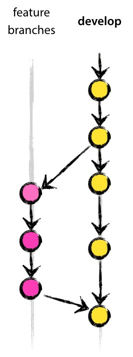
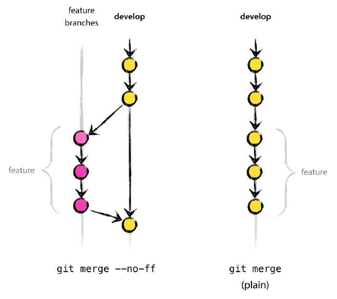
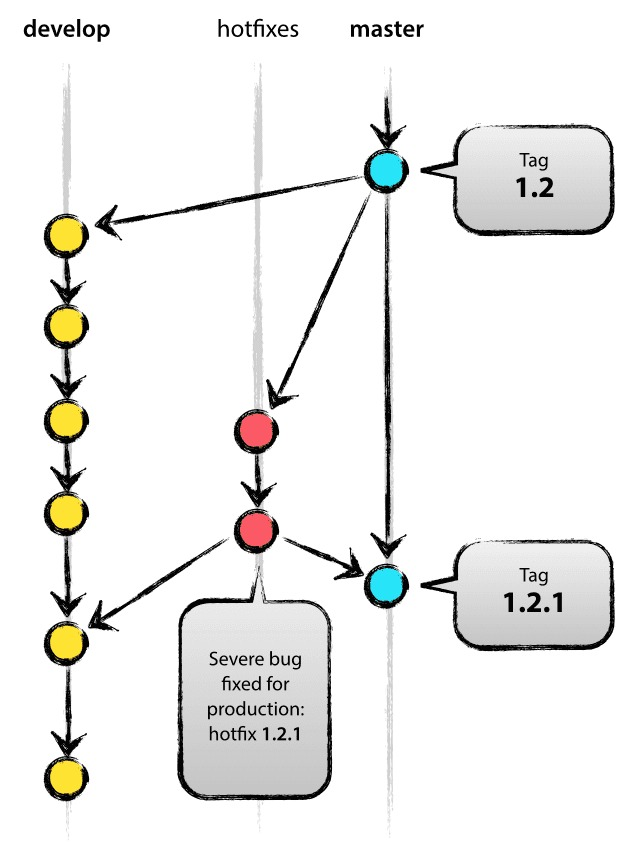

# git 分支策略


将要介绍的这个模型不会比任何一套流程内容多，每个团队成员都必须遵守，这样便于管理软件开发过程。

## 既分散又集中

我们使用的，且与这个分支模型配合的非常好的库，他有一个“真正”的中央仓库。注意，这个库只是被认为是中央仓库(因为Git是一个分布式的版本控制工具，在技术层面没有所谓的中央仓库)。我们将会为这个仓库起名为origin，因为所有的Git用户对这个名字都比较熟悉。


每个开发者从origin拉取和推送代码。除了集中式的推送拉取关系，每个开发者也有可能从别的开发者处拉取代码，形成自己的团队。例如当与两个或者更多的人开发一个大的特性时，或者在将代码推送到origin之前，这种代码管理模式可能有用。在上图中，存在Alice和Bob，Alice和David，Clair 和David三个子团队

技术上而言，这只不过意味着Alice定义了一个远程Git仓库，起名为bob，实际上指向Bob的版本库，反之亦然(Bob定义了一个远程Git仓库，起名为alice，实际上指向Alice的版本库)。

##主分支


老实说，我们讨论的开发模型受到了当前已存在模型的很大启发。集中式的版本库有两个永久存在的主分支：

* master分支
* develop分支

origin的master分支每个Git用户都很熟悉。平行的另外一个分支叫做develop分支。

我们认为origin/master这个分支上HEAD引用所指向的代码都是可发布的。

我们认为origin/develop这个分支上HEAD引用所指向的代码总是反应了下一个版本所要交付特性的最新的代码变更。一些人管它叫“整合分支”。它也是自动构建系统执行构建命令的分支。

当develop分支上的代码达到了一个稳定状态，并且准备发布时，所有的代码变更都应该合并到master分支，然后打上发布版本号的tag。具体如何进行这些操作，我们将会讨论。

因此，每次代码合并到master分支时，它就是一个人为定义的新的发布产品。理论上而言，在这我们应该非常严格，当master分支有新的提交时，我们应该使用Git的钩子脚本执行自动构建命令，然后将软件推送到生产环境的服务器中进行发布。

## 辅助性分支

紧邻master和develop分支，我们的开发模型采用了另外一种辅助性的分支，以帮助团队成员间的并行开发，特性的简单跟踪，产品的发布准备事宜，以及快速的解决线上问题。不同于主分支，这些辅助性分支往往只要有限的生命周期，因为他们最终会被删除。

我们使用的不同类型分支包括:

* 特性分支(feature)
* 发布分支(release)
* 补丁修复分支(hotfix)

上述的每一个分支都有其特殊目的，也绑定了严格的规则：哪些分支是自己的拉取分支，哪些分支是自己的目标合并分支。

从技术角度看，这些分支的特殊性没有更多的含义。只是按照我们的使用方式对这些分支进行了归类。他们依旧是原Git分支的样子。

### 特性分支(feature)



特性分支可以从develop分支拉取建立，最终必须合并会develop分支。特性分支的命名，除了 master， develop， release-\*，或hotfix-\*以外，可以随便起名。

特性分支(有时候也成主题分支)用于开发未来某个版本新的特性。当开始一个新特性的开发时，这个特性未来将发布于哪个目标版本，此刻我们是不得而知的。特性分支的本质特征就是只要特性还在开发，他就应该存在，但最终这些特性分支会被合并到develop分支(目的是在新版本中添加新的功能)或者被丢弃(它只是一个令人失望的试验)

特性分支只存在开发者本地版本库，不在远程版本库。

**创建特性分支**

当开始开发一个新特性时，从develop分支中创建特性分支

```
$ git checkout -b myfeature develop
Switched to a new branch "myfeature"
```

**在develop分支整合已经开发完成的特性**

开发完成的特性必须合并到develop分支，即添加到即将发布的版本中。

```
$ git checkout develop
Switched to branch 'develop'
$ git merge --no-ff myfeature
Updating ea1b82a..05e9557
(Summary of changes)
$ git branch -d myfeature
Deleted branch myfeature (was 05e9557).
$ git push origin develop
```

--no-ff参数的作用是在合并的时候，会创建一个新的提交对象，即使是fast-forward方式的合并。这就避免了丢失特性分支的历史记录信息以及提交记录信息。比较一下



在右面的例子中，是不可能从Git历史记录中看到一个已经实现了的特性的所有提交对象-除非你去查看所有的日志信息。要想获取整个特性分支信息，在右面的例子中的确是一个头疼的问题，但是如果使用--no-ff参数就没有这个问题。

使用这个参数后，的确创建了一些新的提交对象(那怕是空提交对象)，但是很值得。

不幸的是，我还没有找到一种方法使Git默认的merge操作带着--no-ff参数，但的确应该这样。

### 发布分支(release)

从develop分支去建立release分支，release分支必须合并到develop分支和master分支，release分支名可以这样起名:release-*。

release分支用于支持一个新版本的发布。他们允许在最后时刻进行一些小修小改。甚至允许进行一些小bug的修改，为新版本的发布准要一些元数据(版本号，构建时间等)。通过在release分支完成这些工作，develop分支将会合并这些特性以备下一个大版本的发布。

从develop分支拉取新的release分支的时间点是当开发工作已经达到了新版本的期望值。至少在这个时间点，下一版本准备发布的所有目标特性必须已经合并到了develop分支。更远版本的目标特性不必合并会develop分支。这些特性必须等到个性分支创建后，才能合并回develop分支

在release分支创建好后，就会获取到一个分配好即将发布的版本号，不能更早，就在这个时间点。在此之前，develop分支代码反应出了下一版本的代码变更，但是到底下一版本是 0.3 还是 1.0，不是很明确，直到release分支被建立后一切都确定了。这些决定在release分支开始建立，项目版本号等项目规则出来后就会做出。

**创建release分**

从develop分支创建release分支。例如1.1.5版本是当前产品的发布版本，我们即将发布一个更大的版本。develop分支此时已经为下一版本准备好了，我们决定下一版的版本号是1.2(1.1.6或者2.0也可以)。所以我们创建release分支，并给分支赋予新的版本号:

```
$ git checkout -b release-1.2 develop
Switched to a new branch "release-1.2"
$ ./bump-version.sh 1.2
Files modified successfully, version bumped to 1.2.
$ git commit -a -m "Bumped version number to 1.2"
[release-1.2 74d9424] Bumped version number to 1.2
1 files changed, 1 insertions(+), 1 deletions(-)
```

创建好分支并切到这个分支后，我们给分支打上版本号。bump-version.sh是一个虚构的shell脚本，它更改了工作空间的某些文件来反映新版本特征。(当然也可以手动改变这些文件)，然后版本就被提交了。

新的分支会存在一段时间，直到新版本最终发布。在这段时间里，bug的解决可以在这个分支进行(不要在develop分支进行)。此时是严禁添加新的大特性。这些修改必须合并回develop分支，之后就等待新版本的发布。

**结束一个release分支**

当release分支的准备成为一个真正的发布版本时，一些操作必须需要执行。首先，将release分支合并回master分支(因为master分支的每一次提交都是预先定义好的一个新版本，谨记)。然后为这次提交打tag，为将来去查看历史版本。最后在release分支做的更改也合并到develop分支，这样的话，将来的其他版本也会包含这些已经解决了的bug。

在Git中需要两步完成:

```
$ git checkout master
Switched to branch 'master'
$ git merge --no-ff release-1.2
Merge made by recursive.
(Summary of changes)
$ git tag -a 1.2
```

这样release分支已经完成工作，tag也已经打了。

> 备注：你可以使用-s or -u <key>参数为你的tag设置标签签名。

为了保存这些在release分支所做的变更，我们需要将这些变更合并回develop分支。执行如下Git命令:

```
$ git checkout develop
Switched to branch 'develop'
$ git merge --no-ff release-1.2
Merge made by recursive.
(Summary of changes)
```

这步有可能会有合并冲突(极有可能，因为我们已经改变了版本号)。如果有冲突，解决掉他，然后提交。
现在我们已经完成了工作，release分支可以删除了，因为我们不在需要他:

```
$ git branch -d release-1.2
Deleted branch release-1.2 (was ff452fe).
```

### 补丁修复分支(hotfix)



hotfix分支从master分支建立，必须合并回develop分支和master分支，为hotfix分支可以这样起名:hotfix-*

hotfix分支在某种程度上非常像release分支，他们都意味着为某个新版本发布做准备，并且都是预先不可知的。hotfix分支是基于当前生产环境的产品的一个bug急需解决而必须创建的。当某个版本的产品有一个严重bug需要立即解决，hotfix分支需要从master分支上该版本对应的tag上进行建立，因为这个tag标记了产品版本

**创建hotfix分支**

hotfix分支从master分支进行创建。例如当前线上1.2版本产品因为server端的一个Bug导致系统有问题。但是在develop分支进行更改是不靠谱的，所以我们需要建立hotfix分支，然后开始解决问题:

```
$ git checkout -b hotfix-1.2.1 master
Switched to a new branch "hotfix-1.2.1"
$ ./bump-version.sh 1.2.1
Files modified successfully, version bumped to 1.2.1.
$ git commit -a -m "Bumped version number to 1.2.1"
[hotfix-1.2.1 41e61bb] Bumped version number to 1.2.1
1 files changed, 1 insertions(+), 1 deletions(-)
```

千万别忘记在创建分支后修改版本号。

然后解决掉bug，提交一次或多次。

```
$ git commit -m "Fixed severe production problem"
[hotfix-1.2.1 abbe5d6] Fixed severe production problem
5 files changed, 32 insertions(+), 17 deletions(-)
```

**结束hotfix 分支**

完成工作后，解决掉的bug代码需要合并回master分支，但同时也需要合并到develop分支，目的是保证在下一版中该bug已经被解决。这多么像release分支啊。

首先，对master分支进行合并更新，然后打tag

```
$ git checkout master
Switched to branch 'master'
$ git merge --no-ff hotfix-1.2.1
Merge made by recursive.
(Summary of changes)
$ git tag -a 1.2.1
```

> *备注:你可以使用-s or -u <key>参数为你的tag设置标签签名。*

紧接着，在develop分支合并bugfix代码

```
$ git checkout develop
Switched to branch 'develop'
$ git merge --no-ff hotfix-1.2.1
Merge made by recursive.
(Summary of changes)
```
这里可能会有一些异常情况，当一个release分支存在时，hotfix 分支需要合并到release 分支，而不是develop分支。当release分支的使命完成后，合并回release分支的bugfix代码最终也会被合并到develop分支。(当develop分支急需解决这些bug，而等不到release分支的结束，你可以安全的将这些bugfix代码合并到develop分支，这样做也是可以的)。

最后删除这些临时分支

```
$ git branch -d hotfix-1.2.1
Deleted branch hotfix-1.2.1 (was abbe5d6).
```

## 总结

这个分支模型其实没有什么震撼人心的新东西，这篇文章开始的那个“最大图片”已经证明了他在我们工程项目中的巨大作用。它会形成一种优雅的理想模型，而且很容易理解，该模型也允许团队成员形成一个关于分支和版本发布过程的相同理念。

[进一步学习Git](https://github.com/xirong/my-git)