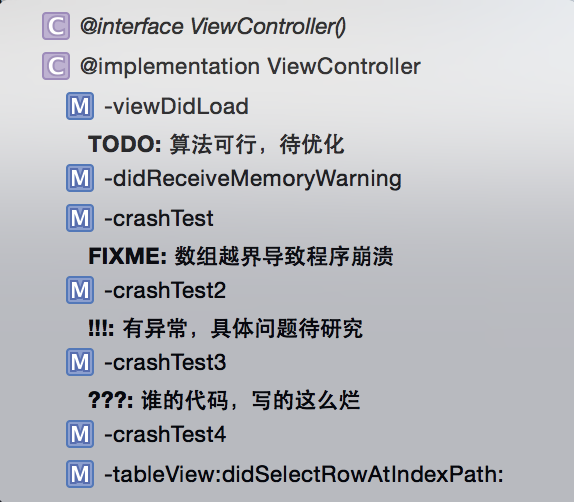

# 代码注释规范

当需要的时候，注释应该被用来解释 为什么 特定代码做了某些事情。所使用的任何注释必须保持最新，否则就删除掉。

通常应该避免一大块注释，代码就应该尽量作为自身的文档，只需要隔几行写几句说明。这并不适用于那些用来生成文档的注释。

## 文件注释

```
//
//  [File Name]
//  [Project Name]
//
//  Created by [Author Name] on [Create Time].
//  Copyright (c) 2015年 [Organization Name]. All rights reserved.
//
//  [Description]
//  [History]
//      1. [Author] [Time]: [Update Log];
//      2. [Author] [Time]: [Update Log];
```

其中，History可选，但是对外的SDK，如果头文件有修改，必须在History里面说明

## import注释

如果有一个以上的 import 语句，就对这些语句安装引入文件的类型进行[分组][Import_1]。每个分组的注释是可选的。   
注：对于模块使用 [@import][Import_2] 语法。   

```objective-c
	// Frameworks
	@import QuartzCore;
	
	// Models
	#import "NYTUser.h"
	
	// Views
	#import "NYTButton.h"
	#import "NYTUserView.h"

  // Controllers
  #import "NYTTodayViewController.h"
  #import "NYTHistoryViewController.h"
```   

[Import_1]: http://ashfurrow.com/blog/structuring-modern-objective-c
[Import_2]: http://clang.llvm.org/docs/Modules.html#using-modules

## 方法注释

除非你认为你的方法名取得非常完美，否则你还是需要给方法添加注释。
注释采用javadoc的格式，可以使用XCode插件VVDocumenter-Xcode快速添加，只需输入`///`即可

```objective-c
/**
 *  功能描述
 *
 *  @param tableView 参数说明
 *  @param section   参数说明
 *
 *  @return 返回值说明
 */
- (NSString *)tableView:(UITableView *)tableView titleForHeaderInSection:(NSInteger)section {
    return [self.familyNames objectAtIndex:section];
}
```

## 代码块注释

单行的用`//`+空格开头，多汗的采用`/*  */`注释

## 重点注释

Xcode 支持几种类型的重点注释，可以方便在文件导航中查看，分别是：TODO、FIXME、???、!!!。

使用格式如下：
  
```objective-c
// TODO: 算法可行，待优化
// FIXME: 数组越界导致程序崩溃
// !!!: 有异常，具体原因待研究
// ???: 谁的代码，写的这么烂 
```

虽然这几种注释都能起到提示左右，这里还是对它们的使用场景进行一定区分：

* TODO 用于提示待完善的代码或待完成功能；
* FIXME 用于提示已知待修改问题（Bug）；
* !!! 用于提示非常重要，但目前还不知道原因的问题；
* ??? 用于团队合作或代码走查时遇到的疑问，起沟通作用；

大部分情况下 TODO 和 FIXME 两个就已经够用了。




